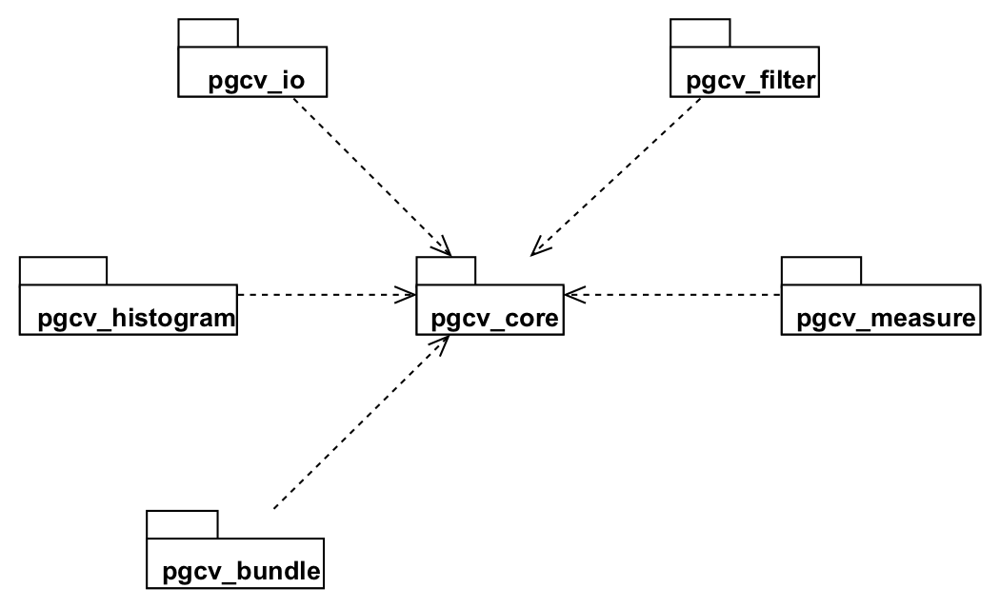
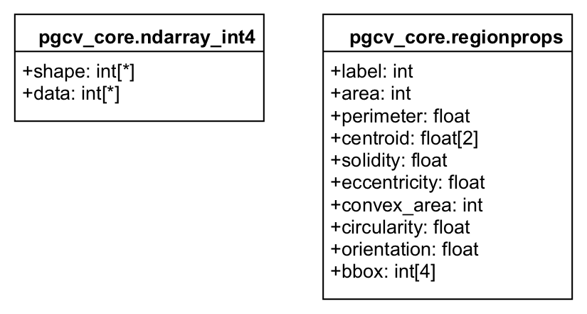
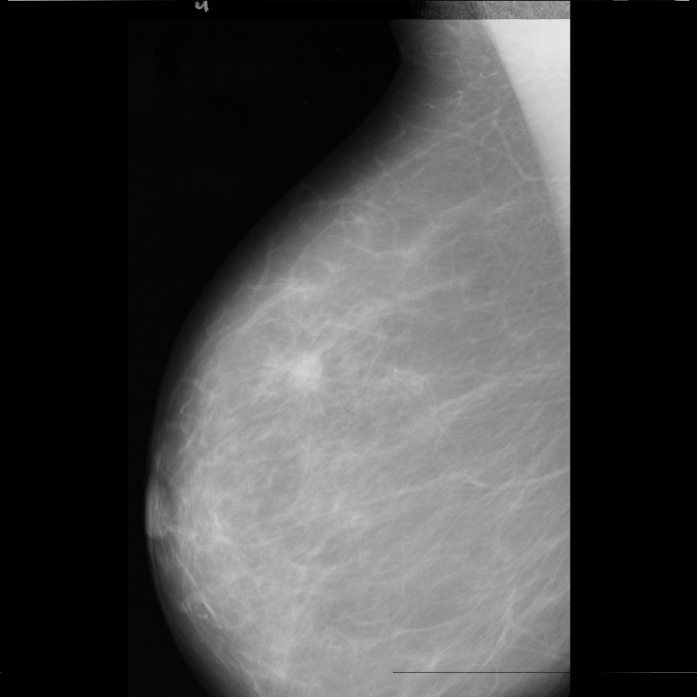
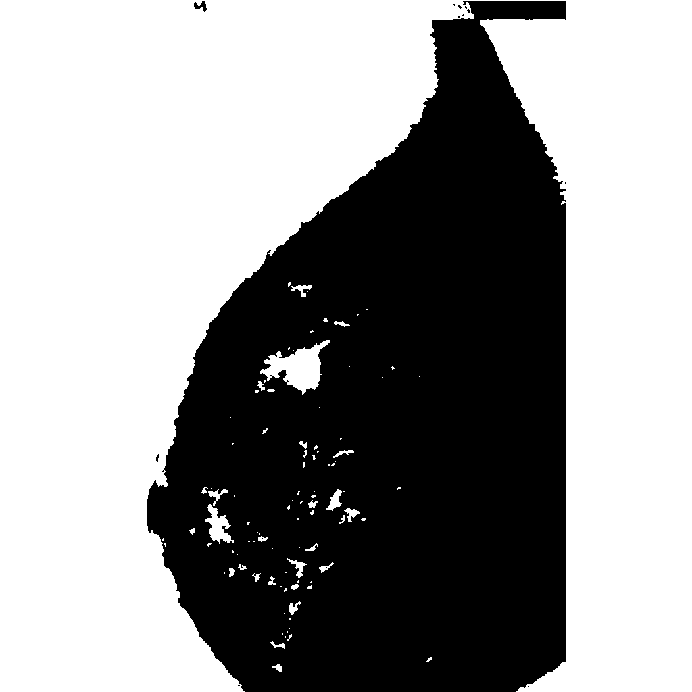

# pgcv - Computer Vision Objects for PostgreSQL

`pgcv` is a PostgreSQL extension for Computer Vision from the database server. The extension implements algorithms for image segmentation, in particular: digital mammogram segmentation.

The extension implements both data types and functions. The data types are PostgreSQL composite types and the functions were created using PL/Python, meaning the function's body is written in Python.

- [pgcv - Computer Vision Objects for PostgreSQL](#pgcv---computer-vision-objects-for-postgresql)
  - [Requirements](#requirements)
  - [Structure](#structure)
    - [Data Types](#data-types)
    - [Function Modules](#function-modules)
      - [pgcv_io](#pgcv_io)
        - [`image_read`](#image_read)
        - [`image_write`](#image_write)
      - [pgcv_filter](#pgcv_filter)
        - [`blur_median`](#blur_median)
        - [`threshold_otsu`](#threshold_otsu)
        - [`enhancement_otsu`](#enhancement_otsu)
        - [`binarize`](#binarize)
      - [pgcv_histogram](#pgcv_histogram)
        - [`hist_bin_edges`](#hist_bin_edges)
        - [`hist_bin_centers`](#hist_bin_centers)
      - [pgcv_measure](#pgcv_measure)
        - [`region_props_json`](#region_props_json)
        - [`region_props`](#region_props)
      - [pgcv_bundle](#pgcv_bundle)
        - [`mam_region_props`](#mam_region_props)
  - [Example](#example)
    - [Image Segmentation](#image-segmentation)
    - [Object Extraction](#object-extraction)
  - [Appendix A - Source Code](#appendix-a---source-code)
    - [pgcv_core source code](#pgcv_core-source-code)
    - [pgcv_io source code](#pgcv_io-source-code)
    - [pgcv_filter source code](#pgcv_filter-source-code)
    - [pgcv_histogram source code](#pgcv_histogram-source-code)
    - [pgcv_measure source code](#pgcv_measure-source-code)
    - [pgcv_bundle source code](#pgcv_bundle-source-code)

## Requirements

This extension requires the following:

- PostgreSQL (version 10 recommended)
- Python3
- The following Python packages
  - Numpy
  - Scipy
  - scikit-image
  - Pillow
  - Pandas
- `plpython3u` installed in the PostgreSQL database

The mentioned Python packages can be installed by executing the following command on your terminal:

```bash
pip3 install numpy scipy scikit-image pandas Pillow
```

## Structure

The extension was structured into SQL-schemas because it allows the possibility to modularize the functions and group them into logical packages.

There are 7 schemas in the extension. `pgcv_core` defines the datatypes and the rest of the schemas define the functions that operate over theese datatypes.

The following diagram shows the dependency structure of these schemas:

<div style="text-align:center"></div>

### Data Types

There are two datatypes in the `pgcv_core`: `ndarray_int4` and `pegionprops`, as shown in the figure bellow:

<div style="text-align:center"></div>


1. `pgcv_core.ndarray_int4`: N-dimensional array of int4 elements. Used to represent and store images. The shape is a tuple of N integers (one for each dimension) that provides information on how far the index can vary along that dimension. The data is a buffer which contains a flattened representation of the multidimensional array's data
2. `pgcv_core.regionprops`: Region properties of an object found in a binary image. The properties contained in this type are label, area, perimeter, centroid, silidity, eccentricity, convex_area, circularity, orientation and bbox (bounding box)

### Function Modules

#### pgcv_io

This schema contains the image input and output functions to the filesystem. Meaning that this functions read and write images into files.

##### `image_read`

Reads an image from a file into an `ndarray_int4`.

```sql
-- having a filename of a grayscale image in disk
SELECT shape FROM pgcv_io.image_read('<filename>');
```

##### `image_write`

Writes an image from an ndarray_int4 into the specified filename (path).

```sql
-- having an image in the database and the output filename
SELECT pgcv_io.image_write(<image>, '<filename>');
```

---

#### pgcv_filter

This schema contains the image filtering functions. One example of this functions is the `median_blur` which replaces each pixel by the median of a local window array given by a kernel size.

##### `blur_median`

Perform a median filter on an N-dimensional array.

```SQL
-- having an image in the database and
-- an odd kernel size (kernel size defaults to 5 if not specified)
SELECT pgcv_filter.median_blur(<image>, [<kernel size>]);
```

##### `threshold_otsu`

Calculates a threshold value based on Otsu's method.

```SQL
-- having an image in the database
SELECT pgcv_filter.threshold_otsu(<image>);
```

##### `enhancement_otsu`

Enhances an image using the Otsu's threshold. Used for mammogram analysis.

This function uses a method designed by Johnny Villalobos that has proven to be quite effective for mammogram segmentation. It is described follows:

Let $t$ be the _threshold_ of an image calculated through the Otsu's method, $max$ the maximum grayscale value of the image and $f$ the enhancement factor so that

$$f = \frac{t}{255 - t}$$

the value of each enhanced pixel $p'$ corresponds to

$$ p' = (1 - f) (max - p (1 + f)) $$

```SQL
-- having an image in the database
SELECT pgcv_filter.enhancement_otsu(<image>);
```

##### `binarize`

Binarizes an image according to the supplied threshold.

```SQL
-- having an image in the database and a threshold value
SELECT pgcv_filter.binarize(<image>, <threshold>);
```

---

#### pgcv_histogram

This schema contains the histogram computing functions. There are two main kinds of histograms in pgcv, both return an histogram and a set of bin features (either the center of the bins or the edges)

##### `hist_bin_edges`

Compute the histogram of a set of data and the bin edges

```SQL
-- having an image in the database,
-- the number of bins (bins defaults to 10 if not specified)
-- and whether the histogram has to be normalized or not
SELECT * FROM pgcv_histogram.hist_bin_edges(<image>, [<bins>, [<as_float>]]);
```

##### `hist_bin_centers`

Compute the normalized histogram of a set of data and the bin centers

```SQL
-- having an image in the database
-- and the number of bins (bins defaults to 10 if not specified)
SELECT * FROM pgcv_histogram.hist_bin_centers(<image>, [<bins>]);
```

---

#### pgcv_measure

This schema contains the functions that perform measure computations on the image. In particular, `pgcv_measure` includes de region properties functions, which find objects on a binarize image

##### `region_props_json`

Returns a json array with the region properties of a binary image

```SQL
-- having a binarized image in the database
SELECT pgcv_measure.region_props_json(<image>);
```

##### `region_props`

Returns a set of region properties found in a binary image

```SQL
-- having a binarized image in the database
-- this allows for the inclusion of WHERE conditions
-- for filter the properties
SELECT * FROM pgcv_measure.region_props(<image>);
```

---

#### pgcv_bundle

The bundle schema provides access to common successive operations performed to an image. The purpose of this schema is to reduce the overhead produced by the comunication from the PostgreSQL server and Python.

##### `mam_region_props`

Returns a set of region properties found in a mammogram image

```SQL
-- having an image in the database
-- and odd kernel size (kernel size defaults to 5 if not specified)
SELECT * FROM pgcv_bundle.mam_region_props(<image>, [<kernel size>]);
```

## Example

The following example shows the sequence of SQL commands needed to perform a mammogram segmentation using the `pgcv`. The image used for this example is an mammogram taken from the MIAS MiniMammographic Database:

<div style="text-align:center"></div>

This example is divided into two steps: the image segmentation using the Otsu enhancement and the object extraction using the region properties

### Image Segmentation

The following steps show the needed steps to perform the segmentation

- Read the image from the file system
- Perform a median_blur
- Compute the Otsu threshold of the image
- Enhance the image
- Binarize the image using the threshold

```SQL
DO $_$
DECLARE
  image pgcv_core.ndarray_int4;
  result pgcv_core.ndarray_int4;
  thresh float;
BEGIN
  image :=  (SELECT pgcv_filter.blur_median(
                      pgcv_io.image_read('/path/to/original/image.png'), 5
                    ));
  thresh := (SELECT pgcv_filter.threshold_otsu(image));
  result := (SELECT pgcv_filter.binarize(pgcv_filter.enhancement_otsu(image), thresh));
  PERFORM pgcv_io.image_write(result, '/path/to/binarized/image.png');
END
$_$
```

The result of this process is the following image:

<div style="text-align:center"></div>

### Object Extraction

The object extraction consists of a single SQL query that computes the region properties and allows to filter them through a WHERE clause

```SQL
SELECT
  label, area, perimeter, centroid, circularity
FROM pgcv_measure.region_props(pgcv_io.image_read('/Users/ro/Desktop/prueba.png')) WHERE area > 15 AND area < 55;
-- you could also include solidity, eccentricity, convex_area, orientation and bbox in the query
```

The result of this query is the following table of region properties

| label | area | perimeter          | centroid                                      | circularity        |
| ----- | ---- | ------------------ | --------------------------------------------- | ------------------ |
| 4     | 20   | 15.071067811865474 | {299.75000000000000000,832.80000000000000000} | 1.1065010026804611 |
| 5     | 19   | 14.242640687119286 | {420.26315789473680000,427.31578947368420000} | 1.1770161688565013 |
| 10    | 36   | 20.727922061357855 | {473.47222222222223000,481.33333333333330000} | 1.0529332270693823 |
| 13    | 16   | 13.242640687119284 | {490.68750000000000000,461.25000000000000000} | 1.1465174146811834 |
| 19    | 17   | 13.071067811865474 | {544.00000000000000000,580.88235294117650000} | 1.250364543402942  |
| 24    | 48   | 26.485281374238568 | {577.29166666666660000,400.58333333333330000} | 0.8598880610108875 |
| 25    | 27   | 17.65685424949238  | {578.70370370370370000,379.37037037037040000} | 1.0882958272169045 |
| 29    | 30   | 22.727922061357855 | {637.46666666666670000,391.53333333333336000} | 0.7298131021442217 |
| 35    | 30   | 20.14213562373095  | {661.76666666666670000,467.10000000000000000} | 0.929223291202501  |
| 36    | 34   | 26.106601717798213 | {670.52941176470590000,451.55882352941177000} | 0.6268853111775277 |
| 39    | 24   | 19.692388155425117 | {676.58333333333340000,464.00000000000000000} | 0.7777219038741342 |
| 41    | 26   | 19.44974746830583  | {687.46153846153850000,449.30769230769230000} | 0.8636848033284439 |
| 44    | 17   | 13.071067811865476 | {687.00000000000000000,492.52941176470586000} | 1.2503645434029418 |
| 46    | 17   | 13.071067811865476 | {722.23529411764710000,590.00000000000000000} | 1.2503645434029418 |
| 55    | 23   | 15.65685424949238  | {734.34782608695650000,462.91304347826090000} | 1.1790403893488048 |
| 62    | 20   | 15.071067811865474 | {750.40000000000000000,426.75000000000000000} | 1.1065010026804611 |
| 64    | 32   | 20.520815280171306 | {758.00000000000000000,461.71875000000000000} | 0.9549279835285656 |
| 65    | 50   | 32.935028842544405 | {768.68000000000000000,506.98000000000000000} | 0.5792469719204167 |
| 67    | 25   | 17.071067811865476 | {768.28000000000000000,537.20000000000000000} | 1.0780241689052945 |
| 69    | 18   | 13.071067811865476 | {773.83333333333340000,366.72222222222223000} | 1.3239153988972323 |
| 70    | 51   | 25.556349186104047 | {785.56862745098040000,284.41176470588240000} | 0.98125619872571   |
| 98    | 26   | 18.485281374238568 | {868.50000000000000000,457.76923076923080000} | 0.9561611214257792 |
| 99    | 23   | 16.485281374238568 | {872.34782608695650000,422.21739130434780000} | 1.0635183109500363 |
| 108   | 30   | 25.727922061357855 | {942.16666666666660000,428.43333333333334000} | 0.5695366755033309 |
| 112   | 35   | 23.556349186104047 | {975.22857142857140000,635.28571428571430000} | 0.7926143695103078 |

## Appendix A - Source Code

### pgcv_core source code
``` SQL
DROP SCHEMA IF EXISTS  pgcv_core CASCADE;
CREATE SCHEMA pgcv_core;

-- =============================================
-- Author:      Roberto Mora
-- Description: N-dimentional array of int4 elements
-- =============================================
CREATE TYPE pgcv_core.ndarray_int4 AS (
  shape   int[],
  data    int[]
);
COMMENT ON TYPE pgcv_core.ndarray_int4 IS 'N-dimensional array of int4 elements. Used to represent and store images.';

-- =============================================
-- Author:      Roberto Mora
-- Description: Region properties of an object found in a binary image
-- =============================================
CREATE TYPE pgcv_core.regionprops AS (
  label         int,
  area          int,
  perimeter     float,
  centroid      float[2],
  solidity      float,
  eccentricity  float,
  convex_area   int,
  circularity   float,
  orientation   float,
  bbox          int[4]
);
COMMENT ON TYPE pgcv_core.regionprops IS 'Region properties of an object found in a binary image.';

-- =============================================
-- Author:      Roberto Mora
-- Description: Calculates the average hash of an image
-- =============================================
CREATE OR REPLACE FUNCTION pgcv_core.hash_avg(image pgcv_core.ndarray_int4, size int DEFAULT 8)
  RETURNS varchar
AS $$
"""
Calculates the average hash of an image.

Parameters
----------
image : ndarray
    The image represented by a pgcv_core.ndarray_int4.
size : int, optional
    Size of the hash. This size is used to resize the supplied image using 'lanczos' interpolation.
Returns
-------
hash : str
    The average hash in base 16.
Examples
--------
>>> SELECT pgcv_core.hash_avg(pgcv_io.image_read('/path/to/image.png'));
Notes
-----
The input image must be grayscale.
"""

import numpy as np
from scipy import misc

img = np.array(image["data"]).reshape(image["shape"]).astype('uint8')
pixels = misc.imresize(img, (size, size), 'lanczos')
avg = pixels.mean()
diff = pixels > avg

h = 0
s = []
for i,v in enumerate(diff.flatten()):
  if v: h += 2**(i % 8)
  if (i % 8) == 7:
    s.append(hex(h)[2:].rjust(2, '0'))
    h = 0
return "".join(s)
$$ LANGUAGE plpython3u STRICT;
COMMENT ON FUNCTION pgcv_core.hash_avg(pgcv_core.ndarray_int4, int) IS 'Calculates the average hash of an image.';
```
### pgcv_io source code
``` SQL
DROP SCHEMA IF EXISTS  pgcv_io CASCADE;
CREATE SCHEMA pgcv_io;

-- =============================================
-- Author:      Roberto Mora
-- Description: Reads an image from a file into an ndarray_int4
-- =============================================
CREATE OR REPLACE FUNCTION pgcv_io.image_read(filename varchar)
  RETURNS pgcv_core.ndarray_int4
AS $$
"""
Reads an image from a file into an ndarray_int4

Parameters
----------
filename : str
    Filename of the image (path).
Returns
-------
image : ndarray
    The image represented by a pgcv_core.ndarray_int4.
Examples
--------
>>> SELECT shape FROM pgcv_io.image_read('/path/to/image.png');
"""

import numpy as np
from PIL import Image

img = Image.open(filename)
img = np.array(img)

return (list(img.shape), np.ravel(img))
$$ LANGUAGE plpython3u STRICT;
COMMENT ON FUNCTION pgcv_io.image_read(varchar) IS 'Reads an image from a file into an ndarray_int4.';

-- =============================================
-- Author:      Roberto Mora
-- Description: Writes an image from an ndarray_int4 into the specified filename (path)
-- =============================================
CREATE OR REPLACE FUNCTION pgcv_io.image_write(image pgcv_core.ndarray_int4, filename varchar)
  RETURNS boolean
AS $$
"""
Writes an image from an ndarray_int4 into the specified filename (path)

Parameters
----------
image : ndarray
    The image represented by a pgcv_core.ndarray_int4.
filename : str
    Filename of the image (path)
Returns
-------
success : bool
    True if the image was saved successfully
Examples
--------
>>> DO $_$
>>> DECLARE arr pgcv_core.ndarray_int4;
>>> BEGIN
>>> SELECT shape, data FROM pgcv_io.image_read('/path/to/in_image.png') INTO arr;
>>> PERFORM pgcv_io.image_write(arr, '/path/to/out_image.png');
>>> END
>>> $_$
"""

import numpy as np
from PIL import Image

img = np.array(image["data"]).reshape(image["shape"]).astype('uint8')
img = Image.fromarray(img)
img.save(filename)

return True
$$ LANGUAGE plpython3u STRICT;
COMMENT ON FUNCTION pgcv_io.image_write(pgcv_core.ndarray_int4, varchar) IS 'Writes an image from an ndarray_int4 into the specified filename (path).';
```
### pgcv_filter source code
``` SQL
DROP SCHEMA IF EXISTS  pgcv_filter CASCADE;
CREATE SCHEMA pgcv_filter;

-- =============================================
-- Author:      Roberto Mora
-- Description: Perform a median filter on an N-dimensional array.
-- =============================================
CREATE OR REPLACE FUNCTION pgcv_filter.blur_median(image pgcv_core.ndarray_int4, kernel int DEFAULT 5)
  RETURNS pgcv_core.ndarray_int4
AS $$
"""
Perform a median filter on an N-dimensional array.

Apply a median filter to the input array using a local window-size given by kernel.

Parameters
----------
image : ndarray
    The image represented by a pgcv_core.ndarray_int4.
kernel : int, optional
    Local window-size giving the size of the median filter. Defaults to 5
Returns
-------
image : ndarray
    The image represented by a pgcv_core.ndarray_int4.
Examples
--------
>>> DO $_$
>>> DECLARE
>>>   arr pgcv_core.ndarray_int4;
>>>   arr2 pgcv_core.ndarray_int4;
>>> BEGIN
>>> SELECT shape, data FROM pgcv_io.image_read('/path/to/image.png') INTO arr;
>>> SELECT shape, data FROM pgcv_filter.blur_median(arr, 4) INTO arr2;
>>> PERFORM pgcv_io.image_write(arr, '/path/to/unmodified_image.png');
>>> PERFORM pgcv_io.image_write(arr2, '/path/to/modified_image.png');
>>> END
>>> $_$
Notes
-----
Kernel size must be odd
"""

import numpy as np
from scipy import signal

global kernel

if kernel % 2 == 0:
  plpy.notice('Invalid kernel size "{}". Kernel must be odd. Default size 5 will be used instead'.format(kernel))
  kernel = 5

img = np.array(image["data"]).reshape(image["shape"]).astype('uint8')
med = signal.medfilt(img, kernel).astype('uint8')

return (list(med.shape), np.ravel(med))
$$ LANGUAGE plpython3u STRICT;
COMMENT ON FUNCTION pgcv_filter.blur_median(pgcv_core.ndarray_int4, int) IS 'Perform a median filter on an N-dimensional array.';

-- =============================================
-- Author:      Roberto Mora
-- Description: Calculates a threshold value based on Otsu's method.
-- =============================================
CREATE OR REPLACE FUNCTION pgcv_filter.threshold_otsu(image pgcv_core.ndarray_int4)
  RETURNS float
AS $$
"""
Calculates a threshold value based on Otsu's method.

Parameters
----------
image : ndarray
    The image represented by a pgcv_core.ndarray_int4.
Returns
-------
thresh : float
    A float that is the Otsu's threshold.
Examples
--------
>>> SELECT pgcv_filter.threshold_otsu(pgcv_io.image_read('/path/to/image.png'));
"""

import numpy as np
from skimage import filters

img = np.array(image["data"]).reshape(image["shape"]).astype('uint8')
thresh = filters.threshold_otsu(img)

return thresh
$$ LANGUAGE plpython3u STRICT;
COMMENT ON FUNCTION pgcv_filter.threshold_otsu(pgcv_core.ndarray_int4) IS 'Calculates a threshold value based on Otsu''s method.';

-- =============================================
-- Author:      Roberto Mora
-- Description: Enhances an image using the otsu threshold. Used for mammogram analysis
-- =============================================
CREATE OR REPLACE FUNCTION pgcv_filter.enhancement_otsu(image pgcv_core.ndarray_int4)
  RETURNS pgcv_core.ndarray_int4
AS $$
"""
Enhances an image using the otsu threshold. Used for mammogram analysis.

This method was designed by Johnny Villalobos and is described as:
Let t be the threshold of an image calculated through the Otsu's method and f the enhancement factor so that f = t / (255 - t),
the value of each enhanced pixel corresponds to:
    p'  = (255 - p(1 + f)) - f(255 - p(1 + f))
        = (1 - f) (255 - p(1 + f))

This formula has proven to be quite effective for mammogram segmentation

Parameters
----------
image : ndarray
    The image represented by a pgcv_core.ndarray_int4.
Returns
-------
image : ndarray
    Enhanced image represented by a pgcv_core.ndarray_int4.
Examples
--------
>>> SELECT shape from pgcv_filter.enhancement_otsu(pgcv_io.image_read('/path/to/image.png'));
>>> SELECT * from pgcv_io.image_write(
>>>     pgcv_filter.enhancement_otsu(
>>>         pgcv_filter.blur_median(
>>>             pgcv_io.image_read('/path/to/in_image.png'), 5
>>>         )
>>>     ), '/path/to/out_image.png');
Notes
-----
The median blur should be applied previous to this enhancement
"""

import numpy as np
from skimage import filters

img = np.array(image["data"]).reshape(image["shape"]).astype('uint8')
thresh = filters.threshold_otsu(img)
f = thresh / (255 - thresh)

img = (1 - f) * (255 - img * (1 + f))

return (list(img.shape), np.ravel(img).astype('uint8'))
$$ LANGUAGE plpython3u STRICT;
COMMENT ON FUNCTION pgcv_filter.enhancement_otsu(pgcv_core.ndarray_int4) IS 'Enhances an image using the otsu threshold. Used for mammogram analysis';

-- =============================================
-- Author:      Roberto Mora
-- Description: Binarizes an image according to the supplied threshold.
-- =============================================
CREATE OR REPLACE FUNCTION pgcv_filter.binarize(image pgcv_core.ndarray_int4, thresh float DEFAULT 255)
  RETURNS pgcv_core.ndarray_int4
AS $$
"""
Binarizes an image according to the supplied threshold.

Parameters
----------
image : ndarray
    The image represented by a pgcv_core.ndarray_int4.
thresh : float
    The threshold used to binarize the image. The resulting value is 0 if the value is less than the threshold, 255 otherwise
Returns
-------
image : ndarray
    Binarized image represented by a pgcv_core.ndarray_int4.
Examples
--------
>>> SELECT shape from pgcv_filter.binarize(pgcv_io.image_read('/path/to/image.png'), 77);
Notes
-----
If used for mammogram segmentation, consider to apply the enhancement_otsu first and use the threshold_otsu as threshold
"""

import numpy as np
from skimage import filters

img = np.array(image["data"]).reshape(image["shape"]).astype('uint8')
img = np.where(img < thresh, 0, 255)

return (list(img.shape), np.ravel(img).astype('uint8'))
$$ LANGUAGE plpython3u STRICT;
COMMENT ON FUNCTION pgcv_filter.binarize(pgcv_core.ndarray_int4, float) IS 'Binarizes an image according to the supplied threshold.';
```
### pgcv_histogram source code
``` SQL
DROP SCHEMA IF EXISTS  pgcv_histogram CASCADE;
CREATE SCHEMA pgcv_histogram;

-- =============================================
-- Author:      Roberto Mora
-- Description: Compute the histogram of a set of data and the bin edges
-- =============================================
CREATE OR REPLACE FUNCTION pgcv_histogram.hist_bin_edges(image pgcv_core.ndarray_int4, bins int DEFAULT 10, as_float boolean DEFAULT TRUE,
  OUT hist numeric[], OUT bin_edges numeric[])
AS $$
"""
Compute the histogram of a set of data and the bin edges

Parameters
----------
image : ndarray
    The image represented by a pgcv_core.ndarray_int4.
bins : int, optional
    Number of bins in the histogram. Defaults to 10
as_float : bool, optional
    Indicates if the image should be converted as float for the histogram computation. Defaults to TRUE
Returns
-------
hist : array
    The histogram represented by an numeric array.
bin_edges : array
    The bin_edges represented by a numeric array.
Examples
--------
>>> SELECT * FROM pgcv_histogram.hist_bin_edges(pgcv_io.image_read('/path/to/image.png'));
>>> SELECT * FROM pgcv_histogram.hist_bin_edges(pgcv_io.image_read('/path/to/image.png'), 5, FALSE);
>>> SELECT * FROM pgcv_histogram.hist_bin_edges(pgcv_io.image_read('/path/to/image.png'), 5);
Notes
-----
The bin_edges array is of length (length(hist) + 1)
"""

import numpy as np
from skimage import img_as_float

img = np.array(image["data"]).reshape(image["shape"]).astype('uint8')
if (as_float == True):
  img = img_as_float(img)
hist, bin_edges = np.histogram(img, bins)

return (hist, bin_edges)
$$ LANGUAGE plpython3u STRICT;
COMMENT ON FUNCTION pgcv_histogram.hist_bin_edges(pgcv_core.ndarray_int4, int, boolean, OUT int[], OUT numeric[]) IS 'Compute the histogram of a set of data and the bin edges. The user can choose to convert the image to float';

-- =============================================
-- Author:      Roberto Mora
-- Description: Compute the normalized histogram of a set of data and the bin centers
-- =============================================
CREATE OR REPLACE FUNCTION pgcv_histogram.hist_bin_centers(image pgcv_core.ndarray_int4, bins int DEFAULT 10,
  OUT hist numeric[], OUT bin_centers numeric[])
AS $$
"""
Compute the normalized histogram of a set of data and the bin centers

Parameters
----------
image : ndarray
    The image represented by a pgcv_core.ndarray_int4.
bins : int, optional
    Number of bins in the histogram. Defaults to 10
Returns
-------
hist : array
    The normalized histogram represented by an numeric array.
bin_centers : array
    The bin_centers represented by a numeric array.
Examples
--------
>>> SELECT * FROM pgcv_histogram.hist_bin_centers(pgcv_io.image_read('/path/to/image.png'), 5);
>>> SELECT * FROM pgcv_histogram.hist_bin_centers(pgcv_io.image_read('/path/to/image.png'));
Notes
-----
The bin_centers array is of length length(hist)
"""

import numpy as np
from skimage import exposure, img_as_float

img = np.array(image["data"]).reshape(image["shape"]).astype('uint8')
img = img_as_float(img)
hist, bin_centers = exposure.histogram(img, bins)

return (hist, bin_centers)
$$ LANGUAGE plpython3u STRICT;
COMMENT ON FUNCTION pgcv_histogram.hist_bin_centers(pgcv_core.ndarray_int4, int, OUT int[], OUT numeric[]) IS 'Compute the normalized histogram of a set of data and the bin centers.';
```
### pgcv_measure source code
``` SQL
DROP SCHEMA IF EXISTS pgcv_measure CASCADE;
CREATE SCHEMA pgcv_measure;

-- =============================================
-- Author:      Roberto Mora
-- Description: Returns a json array with the region properties found in a binary image
-- =============================================
CREATE OR REPLACE FUNCTION pgcv_measure.region_props_json(image pgcv_core.ndarray_int4)
  RETURNS jsonb
AS $$
"""
Returns a json array with the region properties of a binary image

Parameters
----------
image : ndarray
    The image represented by a pgcv_core.ndarray_int4.
Returns
-------
regionprops : jsonb
    The json array with the region properties, corresponding to label, area, perimeter,
    centroid, solidity, eccentricity, convex_area, circularity, orientation and bbox.
Examples
--------
>>> SELECT pgcv_measure.region_props_json(pgcv_io.image_read('/path/to/binarized/image.png'));
Notes
-----
The input image must be binarized
"""

import numpy as np
import pandas as pd
from skimage import measure
import json

img = np.array(image["data"]).reshape(image["shape"]).astype('uint8')

lbl = measure.label(img)
regions = measure.regionprops(lbl, coordinates='rc')

columns = [('label', int),
           ('area', int),
           ('perimeter', float),
           ('centroid', object),
           ('solidity', float),
           ('eccentricity', float),
           ('convex_area', int),
           ('circularity', float),
           ('orientation', float),
           ('bbox', object)]
df = pd.DataFrame({k: pd.Series(dtype=t) for k, t in columns})

for i, reg in enumerate(regions):
    df.loc[i] = [
        reg.label,
        reg.area,
        reg.perimeter,
        reg.centroid,
        reg.solidity,
        reg.eccentricity,
        reg.convex_area,
        4 * np.pi * reg.area / reg.perimeter ** 2 if reg.perimeter != 0 else np.inf,  # circularity
        reg.orientation,
        reg.bbox
    ]

result = df.to_json(orient='records', double_precision=4)

return (result)
$$ LANGUAGE plpython3u STRICT;
COMMENT ON FUNCTION pgcv_measure.region_props_json(pgcv_core.ndarray_int4) IS 'Returns a json array with the region properties found in a binary image.';

-- =============================================
-- Author:      Roberto Mora
-- Description: Returns a set of region properties found in a binary image
-- =============================================
CREATE OR REPLACE FUNCTION pgcv_measure.region_props(image pgcv_core.ndarray_int4)
  RETURNS SETOF pgcv_core.regionprops
AS $$
"""
Returns a set of region properties found in a binary image

Parameters
----------
image : ndarray
    The image represented by a pgcv_core.ndarray_int4.
Returns
-------
regionprops : setof regionprops
    The set with the region properties, corresponding to label, area, perimeter,
    centroid, solidity, eccentricity, convex_area, circularity, orientation and bbox.
Examples
--------
>>> SELECT * FROM pgcv_measure.region_props(pgcv_io.image_read('/Users/ro/Desktop/prueba.png'))
>>>   WHERE area > 15 AND area < 55;
Notes
-----
The input image must be binarized
"""

import numpy as np
from skimage import measure

img = np.array(image["data"]).reshape(image["shape"]).astype('uint8')

lbl = measure.label(img)
regions = measure.regionprops(lbl, coordinates='rc')

for i, reg in enumerate(regions):
    yield (
        reg.label,
        reg.area,
        reg.perimeter,
        reg.centroid,
        reg.solidity,
        reg.eccentricity,
        reg.convex_area,
        4 * np.pi * reg.area / reg.perimeter ** 2 if reg.perimeter != 0 else np.inf,  # circularity
        reg.orientation,
        reg.bbox
    )
$$ LANGUAGE plpython3u STRICT;
COMMENT ON FUNCTION pgcv_measure.region_props(pgcv_core.ndarray_int4) IS 'Returns a set of region properties found in a binary image.';
```
### pgcv_bundle source code
``` SQL
DROP SCHEMA IF EXISTS pgcv_bundle CASCADE;
CREATE SCHEMA pgcv_bundle;

-- =============================================
-- Author:      Roberto Mora
-- Description: Returns a set of region properties found in a mammogram image
-- =============================================
CREATE OR REPLACE FUNCTION pgcv_bundle.mam_region_props(image pgcv_core.ndarray_int4, kernel int DEFAULT 5)
  RETURNS SETOF pgcv_core.regionprops
AS $$
"""
Returns a set of region properties found in a mammogram image

Parameters
----------
image : ndarray
    The image represented by a pgcv_core.ndarray_int4.
Returns
-------
regionprops : setof regionprops
    The set with the region properties, corresponding to label, area, perimeter,
    centroid, solidity, eccentricity, convex_area, circularity, orientation and bbox.
Examples
--------
>>> SELECT * FROM pgcv_bundle.mam_region_props(pgcv_io.image_read('/Users/ro/Desktop/prueba.png'))
>>>   WHERE area > 15 AND area < 55;
Notes
-----
The input image must be unaltered.
"""

import numpy as np
import pandas as pd
from scipy import signal
from skimage import measure, filters

img = np.array(image["data"]).reshape(image["shape"]).astype('uint8')

"""
1. Apply the mean filter
"""
img = signal.medfilt(img, kernel).astype('uint8')

"""
2. Enhance the image through the otsu enhancement
"""
thresh = filters.threshold_otsu(img)
f = thresh / (255 - thresh)
img = ((1 - f) * (255 - img * (1 + f))).astype('uint8')

"""
3. Binarize the image
"""
img = np.where(img < thresh, 0, 255)

"""
4. Calculate the regionprops
"""
lbl = measure.label(img)
regions = measure.regionprops(lbl, coordinates='rc')

for i, reg in enumerate(regions):
    yield (
        reg.label,
        reg.area,
        reg.perimeter,
        reg.centroid,
        reg.solidity,
        reg.eccentricity,
        reg.convex_area,
        4 * np.pi * reg.area / reg.perimeter ** 2 if reg.perimeter != 0 else np.inf,  # circularity
        reg.orientation,
        reg.bbox
    )
$$ LANGUAGE plpython3u STRICT;
COMMENT ON FUNCTION pgcv_bundle.mam_region_props(pgcv_core.ndarray_int4, int) IS 'Returns a set of region properties found in an unaltered image.';
```
